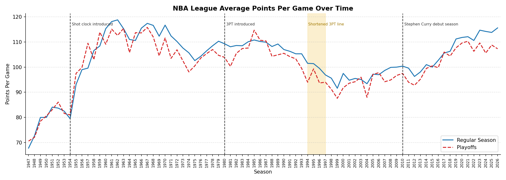

## Introduction 

There are often claims that the NBA has become much quicker and more of a “3 point game”, this is frequently credited to (or blamed on, depending on your point of view) Stephen Curry (for example Abbot (2016) and Weiss (2026)) and the dynasty that he helped create, as well as the ‘91 Denver Nuggets and their 7-second-quick-strike system. This project will investigate if these claims are correct and if so how this has affected performance of teams. To answer this, visualisations will be made from data scraped from [Basketball Reference](https://www.basketball-reference.com/) in accordance with their terms of service. 

## Trends in the NBA 

*Figure 1*

Figure 1 shows the league average points per game (PPG) for each season since the 1946-47 BAA season until the most recent season (the years labelled at the bottom are the years the season ends in). The blue line represents the regular season and the red dotted line represents the playoffs. 

The graphs starts out with a sharp increase in PPG at the beginning of the league – its most drastic increase after the 1954 season. This is because the shot clock was introduced in that year giving teams only 24 seconds to attempt a shot. This had the effect of speeding up the game and increasing the number of possessions drastically, resulting in an increase in scoring. 

This was followed by a large period of stagnation - despite the introduction of the 3 point line which was at the time seen as a gimmick - and then a decrease in PPG around 1986. This was an era of physical defence. Defensive fouls were rare, “grit and grind” teams were strong and hand-checking was prevalent. The “Bad Boys” Detroit Pistons were a team that specialised in this kind of defence and were successful while doing so (becoming back-to-back champions in 1989 and 1990). In addition, the lack of 3-second rule meant “bigs” could stay in the key as long as they wanted and could prevent drives to the rim. Defence being too strong in this era naturally translates to fewer PPG which makes for a less entertaining game and therefore less viewership. The league attempted to remedy this by shortening the distance of the 3 point line from 23.9 feet from the basket at the peak of the arch to 22. This did not have the desired outcome as scoring still declined but was utilised by some teams and players to great effect. 

The modern era then sees a steady increase in PPG. The primary explanation of this is because the game got quicker and more oriented around the 3 point line. Stephen Curry has had great success basing his game around 3 point shots and influencing others to do the same. As well as this, the 7-second-quick-strike system was becoming more widely adopted. This involved teams aiming to put up shots by 7 seconds into their possession and had the philosophy that increasing the amount of shots attempted, even if shooting percentage remained the same, would result in more points. Combining this with full court pressure on defence and therefore frequent turnovers meant possessions were quicker than they had ever been. This strategy was created by Coach Krizancic but pioneered (not necessarily mastered) by the ‘91 Nuggets. 

Most of the graph shows that playoff games have a lower PPG than regular season games. This is because as teams try harder, defence gets better and there are fewer possessions. This in particularly evident in the most recent playoffs. Hollinger (2026) predicts “a turning point in the emphasis teams put on offensive rebounding in particular” and could show a weakening of Curry’s and the 7-second system’s influence. 

*Figure 2*

Figure 2 is the same as figure 1 except it has Pace on the y-axis. Pace is a measure of how many possessions there are in a 48 minute period or a full game (4 quarters of 12 minutes). Therefore having an increasing average pace statistic means the game is getting quicker. Pace is good as a general statistic used to describe how fast the game is but when used specifically for offensive or defensive pace it is flawed (Blackport, 2018). One thing to note is that pace statistics don’t start until 1974 but I have still plotted this with the entire history of the league because it makes it easier to compare between graphs. This is the case with the rest of the line graphs I will use.

This graph initially shows a consistent decrease in pace from when pace statistics begin to roughly the turn of the century. This is linked with the physical era of defence and the reason figure 1 showed a similar pattern during this period. Going into the modern era figure 2 continues to follow the pattern of figure 1. Pace slowly starts to increase and again links to the trend towards quicker 3-point oriented offence and full court defence.

As previously stated, teams trying harder means stronger defence and more methodical play. This is shown in the graph with the playoff line being below the regular season line for the entire history of the league except for a couple of years, those being 1985 and 2015. 1985 could be an outlier because it was very shortly after the doubling (from 8 to 16) of the teams in the playoffs. This means worse teams were in the playoffs which could allow for easier transition points (more frequent turnovers and fast breaks) and therefore more possessions. 2015 was the first championship for the Golden State Warriors lead by Curry and is often said to be the exact moment the game shifted in favour of the 3-point shot, so fast play was being adopted even in the playoffs.

Overall this graph shows a very similar pattern as figure 1 which is unsurprising as trends of PPG are often linked to changes in the pace of the game. For this reason, if pace records went as far back as PPG, you would see a massive spike in 1954 when the shot clock was introduced – just like in figure 1. 

*Figure 3*

Figure 3 shows average 3-point attempts per game. I’m using attempts rather than 3-point percentage because it more closely aligns with the philosophy of the 7-second system.

Figure 3 shows a consistent increase in 3-point attempts from the inception of the 3-point line. This shows that over time players have got better at shooting 3-point shots and therefore they are taken more seriously as a strategy to win. We can also see a spike in 3-point attempts while the 3-point line is shortened. This make sense as these shots are now easier, so why not take advantage? Steve Kerr (now the head coach for Curry and the Warriors) used this to set the highest 3-point percentage of all time at 0.454. This trend of consistent increase becomes more pronounced in the modern age after Steve Kerr has success in transforming the Warriors offence to centre around 3-points. 

3-point attempts are generally higher in the playoffs. This could be explained by teams’ heavier reliance on written up “plays” that are more likely to have the end goal being a 3-point shot. In the very recent seasons this starts to change and again could be an indication of the shift to another era of basketball (Hollinger, 2026).

Overall these figures show that in recent years the NBA has trended away from physical defence and low scoring to quick and snappy possessions with a focus on 3-point shots.

## How Team Performance is Affected by These Trends

Now we have established some of the trends that the NBA is following, we can ask are the good teams utilising these strategies and is this what makes them good teams? To determine if a team is good or not I will be using the Simple Rating System (SRS). This allows us to evaluate a team’s performance by combining average point differential and Strength of Schedule (SOS). An SRS value of 0 represents the most average team in the league and a score of 10 for example, represents a team that is 10 points better than this average. Because of this SRS can also be negative showing a team that is worse than average. SRS is a better way of measuring a team’s true performance than a raw win loss ratio because it is less affected by things like injuries and home court advantage. This being said it can still be fooled by teams coasting and saving their strength for the playoffs since it is a metric primarily used for the regular season. 

*Figure 4*

Figure 4 shows the best (highest SRS score) and worst (lowest SRS score) teams for each season and their pace statistics. The shape of the graph generally follows a similar shape as figure 2 with only a few exceptions. This shows that for the most part teams have not had disproportional success or failure from diverting from the league trend – be that playing more quickly or slowly. 

1991 immediately stands out as an outlier showing that the worst team that season had a much higher pace statistic than the best team and the rest of the league. While Michael Jordan and the Chicago Bulls are winning their first championship of their first 3-peat, the ‘91 Nuggets are revolutionising the way modern basketball is played. They pioneered fast, chaotic, 3-point based play which was a precursor to the modern adaptations more successfully utilised by the ‘05 Phoenix Suns and the dynasty Warriors (Tran, 2025). While they had an astounding 119.9 PPG they also had extremely weak defence allowing opponents to score a record breaking 130.8 PPG on average. While they did not use the strategy to much success they laid the ground work for future teams to adapt to this style of play. 

2020 is the most significant modern outlier showing the Milwaukee Bucks having a higher pace statistic than the worst team and the rest of the league. This team was led by Giannis Antetokounmpo who specialises in getting defensive rebounds leading to fast breaks and transition points. This means faster possessions and a higher pace statistic.

Overall this doesn’t show consistently that top teams have a higher pace statistic than the lowest teams. This could show that the pace of the game is a general trend that the whole league is following rather than any single team utilising it to out perform everyone else. It could also mean that everyone is getting better but no-one is getting better at a disproportional rate because SRS is relative to other teams. 

*Figure 5*

Figure 5 shows the best and worst teams average 3-point attempts in each game. This graph follows the corresponding league average graph just like figure 4 does. However, the green line in figure 5 is consistently higher than the red line. 

*Figure 6*

In fact, 71.7% of seasons have the best team above the worst team when it comes to 3-point attempts, this jumps up to 75% when only looking at seasons since 2010. This is indicative of good teams using a more 3-point oriented strategy.

2018 shows a large gap between the best and worst teams. The best team in this season was the Houston Rockets, averaging 42.3 3-point attempts a game. This team was lead by prime James Harden (one of the league’s greatest scorers) at shooting guard and Chris Paul at point guard, two very good players in roles that specialise in controlling the offence and shooting 3-point shots. 

While pace might not be as good a marker for a good team as I previously thought, figure 5 shows that 3-point attempts could be. 

To investigate this further and to prove if an increase in pace and 3-point attempts relates to an increase in SRS this hypothesis should be applied to a regression model. However this might not have results as significant as I would think. 

*Figure 7*

Figure 7 shows both pace and 3-point attempts plotted against SRS since 2010 and lines of best fit for both plots. It also highlights some of the teams I have spoken about including the ‘91 nuggets team which is from before the time period that these graphs describe and therefore does not affect the line of best fit. This graph has very shallow lines of best fit showing there is little association between these statistics and SRS. Making a full regression model with relevant con-founders like age, season and shooting percentages or using a different statistic to measure team success might tell a different story but for now this data does not show anything statistically significant.

## Conclusions 

The league has changed a lot over its history for many different reasons. The most modern trends being an increase in 3-point attempts and pace. The Warriors are the team most emblematic of these trends. Steve Kerr used the ‘91 Nuggets and the 7-second-quick-strike system as inspiration for how he transformed the Warriors offence and Stephen Curry is widely seen as the mascot for the “3-point game”. While these trends are present there might not be a significant correlation between pace and 3-point attempts and making a team better. Further research in this topic could conduct regression tests to see if this is true or dive into more specific teams and player trends. 

## References

Abbott, H. (2016, March 18). Stephen Curry isn't just the MVP -- he is revolutionizing the game. ESPN.com. [https://www.espn.com/nba/story/_/id/15001418/how-stephen-curry-revolutionizing-basketball](https://www.espn.com/nba/story/_/id/15001418/how-stephen-curry-revolutionizing-basketball)

Basketball Reference. (n.d.). Basketball statistics and history | basketball-reference.com. Basketball-Reference.com. [https://www.basketball-reference.com/](https://www.basketball-reference.com/)

Blackport, D. (2018, April 18). Digging deeper into pace in the NBA. Less Certainty, More Inquiry. [https://darrylblackport.com/posts/2018-04-18-digging-deeper-pace/](https://darrylblackport.com/posts/2018-04-18-digging-deeper-pace/)

Hollinger, J. (2026, April 23). Scoring is way down in the NBA playoffs. here are the 3 possible reasons why. The New York Times. [https://www.nytimes.com/athletic/7220778/2026/04/23/scoring-down-nba-playoffs-2026/](https://www.nytimes.com/athletic/7220778/2026/04/23/scoring-down-nba-playoffs-2026/)

Tran, N. (2025, April 25). The history of 7 seconds or less. Substack.com; The Old Man Game Newsletter. [https://omgnewsletter.substack.com/p/the-history-of-7-seconds-or-less](https://omgnewsletter.substack.com/p/the-history-of-7-seconds-or-less)

Weiss, J. (2026). The Athletic: Stephen Curry changed the game. now he sees it happening in Victor Wembanyama. Nba.com. [https://www.nba.com/news/victor-wembanyama-stephen-curry-change-the-nba](https://www.nba.com/news/victor-wembanyama-stephen-curry-change-the-nba)

